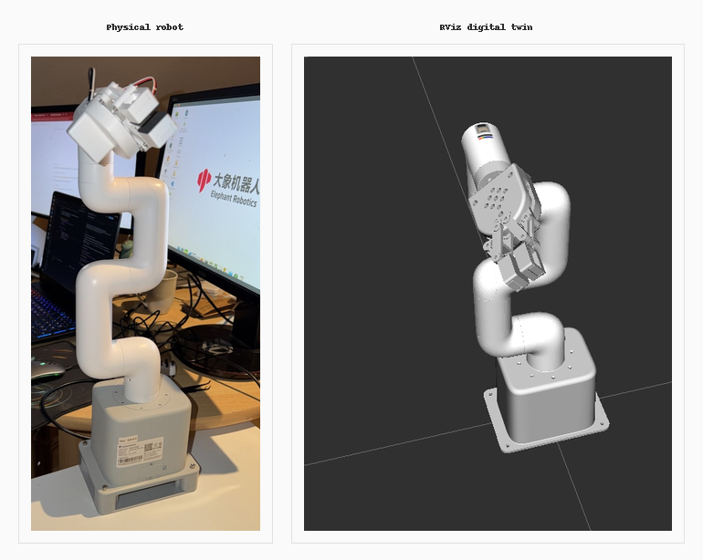

# mycobot_humble

A guarded ROS 2 Humble hardware interface for the Elephant Robotics
myCobot 280 Jetson Nano.

The project publishes physical robot state and provides safety-gated ROS
services for:

- Single-joint movement
- Six-joint pose movement
- Adaptive-gripper control
- Robot status
- Emergency stopping

Physical execution is disabled by default.

The physical joint-state stream also drives the myCobot 280 Jetson Nano
adaptive-gripper model in RViz over ROS 2 DDS.

## Hardware and environment

- Robot: Elephant Robotics myCobot 280 Jetson Nano
- End effector: Adaptive gripper
- Serial port: `/dev/ttyTHS1`
- Baud rate: `1000000`
- ROS distribution: ROS 2 Humble
- Runtime: ARM64 Docker container
- Python API: `pymycobot`
- Tested `pymycobot` version: `4.0.4`

## Safety notice

This is an experimental robotics interface.

Before enabling physical movement:

- Secure the robot base.
- Clear the complete robot workspace.
- Keep people outside the workspace.
- Keep the physical power switch accessible.
- Remove objects from the gripper during testing.
- Start with low speed and small movements.
- Perform a dry run before every new physical command.

The `/mycobot/stop` service is a software safety mechanism. It is not a
replacement for switching off robot power during an unsafe condition.

## Key paths

| Location | Path |
|---|---|
| Host project | `~/mycobot_humble` |
| ROS workspace | `mycobot_ws/` |
| Hardware package | `mycobot_ws/src/mycobot_hardware/` |
| Interface package | `mycobot_ws/src/mycobot_interfaces/` |
| Description package | `mycobot_ws/src/mycobot_description/` |
| Container | `mycobot-humble-jetson` |
| Serial device | `/dev/ttyTHS1` |

## First-time setup

From the Jetson host:

```bash
cd ~/mycobot_humble
docker compose build
docker compose up -d
docker compose exec mycobot bash
```

Inside the container:

```bash
cd /root/mycobot_ws

colcon build \
  --symlink-install \
  --packages-select \
  mycobot_interfaces \
  mycobot_description \
  mycobot_hardware

source install/setup.bash
```

New interactive container shells automatically source ROS 2 Humble and
the workspace.

## Open the container

```bash
cd ~/mycobot_humble
docker compose up -d
docker compose exec mycobot bash
```

Alternative:

```bash
docker exec -it mycobot-humble-jetson bash
```

Multiple shells can be opened in the same container.

## Rebuild after source changes

```bash
cd /root/mycobot_ws

python3 -m py_compile \
  src/mycobot_hardware/mycobot_hardware/state_publisher.py

colcon build \
  --symlink-install \
  --packages-select \
  mycobot_interfaces \
  mycobot_description \
  mycobot_hardware

source install/setup.bash
```

## Start the hardware node

The recommended normal launch loads `hardware.yaml` with all physical
motion gates disabled:

```bash
ros2 launch mycobot_hardware state_publisher.launch.py
```

For the physical RViz digital twin, use the combined safe bringup:

```bash
ros2 launch mycobot_hardware physical_bringup.launch.py
```

This starts both `mycobot_state_publisher` and
`robot_state_publisher`, while explicitly forcing all physical motion
gates to `false`.

Verify the safety gates:

```bash
ros2 param get /mycobot_state_publisher motion_enabled
ros2 param get /mycobot_state_publisher multi_joint_motion_enabled
ros2 param get /mycobot_state_publisher gripper_motion_enabled
```

All three must normally report:

```text
Boolean value is: False
```

## Published topics

| Topic | Message type | Description |
| --- | --- | --- |
| `/joint_states` | `sensor_msgs/msg/JointState` | Six arm joints and the adaptive-gripper controller joint in radians |
| `/mycobot/tool_pose_raw` | `std_msgs/msg/Float64MultiArray` | Raw `[x, y, z, rx, ry, rz]` tool pose in millimetres and degrees |

Inspect them from another container terminal:

```bash
ros2 topic echo /joint_states
ros2 topic echo /mycobot/tool_pose_raw
ros2 topic hz /joint_states
```

## Services

| Service | Type | Purpose |
| --- | --- | --- |
| `/mycobot/status` | `std_srvs/srv/Trigger` | Read controller, power, error, movement and joint state |
| `/mycobot/stop` | `std_srvs/srv/Trigger` | Stop the arm and release adaptive-gripper torque |
| `/mycobot/move_joint` | `mycobot_interfaces/srv/MoveJoint` | Validate or execute one joint movement |
| `/mycobot/move_joints` | `mycobot_interfaces/srv/MoveJoints` | Validate or execute a six-joint pose |
| `/mycobot/set_gripper` | `mycobot_interfaces/srv/SetGripper` | Validate or execute adaptive-gripper open/close |

### Robot status

```bash
ros2 service call /mycobot/status \
  std_srvs/srv/Trigger "{}"
```

A healthy idle response contains:

```text
connected=1, power=1, error=0, moving=0
```

### Emergency stop

```bash
ros2 service call /mycobot/stop \
  std_srvs/srv/Trigger "{}"
```

This:

- Sets the internal stop-request flag.
- Sends the arm stop command.
- Sends the adaptive-gripper release command.
- Takes priority over movement completion checks.

## Dry-run commands

Dry runs perform all validation but do not send physical movement
commands.

### Single joint

```bash
ros2 service call /mycobot/move_joint \
  mycobot_interfaces/srv/MoveJoint \
  "{joint_id: 1, target_degrees: 3.0, speed: 10, execute: false}"
```

### Six-joint pose

Use targets close to the freshly measured physical pose:

```bash
ros2 service call /mycobot/move_joints \
  mycobot_interfaces/srv/MoveJoints \
  "{target_degrees: [2.0, -2.0, -1.0, -7.0, -2.0, -142.0], speed: 10, execute: false}"
```

### Adaptive gripper

Open:

```bash
ros2 service call /mycobot/set_gripper \
  mycobot_interfaces/srv/SetGripper \
  "{state: 0, speed: 10, execute: false}"
```

Close:

```bash
ros2 service call /mycobot/set_gripper \
  mycobot_interfaces/srv/SetGripper \
  "{state: 1, speed: 10, execute: false}"
```

Gripper states:

- `0`: open
- `1`: close

## Physical execution

Physical execution requires two deliberate actions:

1. Start the node with the relevant runtime gate enabled.
2. Send a service request with `execute: true`.

The configuration file keeps every gate disabled permanently.

### Enable only single-joint execution

```bash
ros2 run mycobot_hardware state_publisher \
  --ros-args \
  --params-file \
  /root/mycobot_ws/install/mycobot_hardware/share/mycobot_hardware/config/hardware.yaml \
  -p motion_enabled:=true
```

### Enable only six-joint execution

```bash
ros2 run mycobot_hardware state_publisher \
  --ros-args \
  --params-file \
  /root/mycobot_ws/install/mycobot_hardware/share/mycobot_hardware/config/hardware.yaml \
  -p multi_joint_motion_enabled:=true
```

### Enable only gripper execution

```bash
ros2 run mycobot_hardware state_publisher \
  --ros-args \
  --params-file \
  /root/mycobot_ws/install/mycobot_hardware/share/mycobot_hardware/config/hardware.yaml \
  -p gripper_motion_enabled:=true
```

Stop the temporarily enabled node with `Ctrl+C` and return to the normal
launch immediately after physical testing.

## Default parameters

| Parameter | Default | Description |
| --- | ---: | --- |
| `port` | `/dev/ttyTHS1` | Robot serial device |
| `baud` | `1000000` | Serial baud rate |
| `publish_rate` | `5.0` | State publication rate in Hz |
| `max_joint_step_degrees` | `5.0` | Maximum movement allowed per joint and request |
| `max_speed` | `10` | Maximum accepted arm speed |
| `joint_limit_margin_degrees` | `2.0` | Margin applied inside URDF joint limits |
| `motion_enabled` | `false` | Single-joint execution gate |
| `multi_joint_motion_enabled` | `false` | Six-joint execution gate |
| `motion_timeout_seconds` | `6.0` | Arm movement timeout |
| `position_tolerance_degrees` | `1.5` | Maximum final joint error |
| `motion_poll_period_seconds` | `0.2` | Feedback polling interval |
| `max_gripper_speed` | `20` | Maximum accepted gripper speed |
| `gripper_motion_enabled` | `false` | Physical gripper execution gate |
| `gripper_timeout_seconds` | `5.0` | Gripper operation timeout |
| `gripper_settle_seconds` | `2.0` | Wait used when feedback is initially unavailable |
| `gripper_open_min_value` | `90` | Minimum value accepted as open |
| `gripper_closed_max_value` | `10` | Maximum value accepted as closed |
| `gripper_initial_value` | `0` | Startup visualization fallback; physically confirmed closed |
| `gripper_open_angle_radians` | `0.15` | URDF angle corresponding to fully open |
| `gripper_closed_angle_radians` | `-0.74` | URDF angle corresponding to fully closed |

## Safety behavior

Before accepting movement, the node checks:

- Controller connection
- Robot power
- Controller error state
- Existing arm motion
- Target value validity
- Per-joint limits
- Configured joint-limit margin
- Maximum movement per request
- Maximum permitted speed
- Relevant physical execution gate

During physical movement, it provides:

- Asynchronous robot commands
- A multithreaded ROS executor
- Serialized hardware access with a mutex
- Responsive stop handling
- Controller-error monitoring
- Automatic timeout and stop
- Final-position verification

The single-joint, six-joint, and gripper services share a mutually
exclusive callback group, preventing them from executing simultaneously.

## Adaptive-gripper feedback

Before its first movement, the adaptive gripper may return undocumented
out-of-range values such as `253`, `254`, or `255`.

The driver treats values outside `0–100` as unavailable feedback, never
as physical positions. In this case, the response uses:

```text
start_value=-1
final_value=-1
```

After the first successful opening, the tested gripper returned valid
position feedback:

```text
Open:   98
Closed: 1
```

Physical feedback is mapped linearly into the tested URDF range:

| Physical feedback | Physical state | URDF angle |
| --- | --- | ---: |
| `0` | Fully closed | `-0.74` rad |
| `100` | Fully open | `0.15` rad |

## Physical RViz digital twin

Phase 2 connects the physical robot feedback to the myCobot 280 Jetson
Nano adaptive-gripper model in RViz.

<p align="center">
  
</p>

<p align="center"><em>Physical robot (left) and live RViz model (right), driven by the same <code>/joint_states</code> stream.</em></p>

The physical arm on the Jetson publishes live joint angles. The same
stream drives the URDF model in RViz over ROS 2 DDS, so the digital twin
tracks the real robot in real time.

The Jetson publishes `/joint_states`, `/tf`, `/tf_static`, and the robot
model. The joint-state message contains the six arm joints plus
`gripper_controller`.

### Start physical bringup on the Jetson

From the Jetson host:

```bash
cd ~/mycobot_humble
docker compose up -d
docker compose exec mycobot bash
```

Inside the container:

```bash
cd /root/mycobot_ws
source install/setup.bash
ros2 launch mycobot_hardware physical_bringup.launch.py
```

Verify that all three execution gates remain disabled:

```bash
ros2 param get /mycobot_state_publisher motion_enabled
ros2 param get /mycobot_state_publisher multi_joint_motion_enabled
ros2 param get /mycobot_state_publisher gripper_motion_enabled
```

### Start RViz on the laptop

The Jetson and laptop must be on the same network and use the same
`ROS_DOMAIN_ID`. The tested configuration uses domain `0` with
`ROS_LOCALHOST_ONLY=0`.

After sourcing the laptop workspace:

```bash
source /root/mycobot_ws/install/setup.bash
ros2 launch mycobot_description physical_rviz.launch.py
```

The laptop should run RViz only. The physical bringup on the Jetson
already supplies `robot_state_publisher`.

Verify discovery from the laptop:

```bash
ros2 node list
ros2 topic list | grep -E '^/joint_states$|^/tf$|^/tf_static$'
```

Expected nodes include:

```text
/mycobot_state_publisher
/robot_state_publisher
```

## Serial-port locking

Only one hardware-node process may own the serial port.

The node acquires:

```text
/tmp/mycobot_ttyTHS1.lock
```

Starting a second instance fails instead of allowing competing serial
commands.

Stop the existing node with `Ctrl+C` before launching another instance.

Check for an existing process:

```bash
pgrep -af state_publisher
```

## Phase 1 physical validation

The following tests were completed on the physical myCobot 280:

- Controller connection and power-state checks
- Joint-angle and tool-pose publication
- Single J1 movement
- Single-joint return movement
- Adaptive-gripper opening
- Adaptive-gripper closing
- Six-joint pose movement
- Six-joint return movement
- Execution-gate rejection
- Maximum-step validation
- Final-position verification
- Emergency stop during motion
- Automatic timeout and stop
- Safe-default restoration after every test

Emergency-stop testing interrupted an intended `8°` J1 movement after
approximately `1°`, with:

```text
error=0
moving=0
```

The automatic-timeout test stopped a command after `0.1 s`, also with:

```text
error=0
moving=0
```

## Troubleshooting

| Problem | Action |
| --- | --- |
| `ros2: command not found` | Source `/opt/ros/humble/setup.bash` and `install/setup.bash` |
| Container is not running | Run `docker compose up -d` |
| Serial port is already owned | Stop the existing hardware node |
| Controller is disconnected | Check power, Atom connection and `/dev/ttyTHS1` |
| Gripper reports `253–255` | Treat it as unavailable feedback and perform only guarded initialization |
| Movement is rejected | Inspect the service response and current safety-gate parameters |
| Source changes are not visible | Rebuild the affected packages and source `install/setup.bash` |
| Docker image must be rebuilt | Run `docker compose build --no-cache` |
| RViz reports No tf data | Confirm that `physical_bringup.launch.py` is running on the Jetson |
| `/joint_states` has multiple TF consumers | Stop duplicate `robot_state_publisher` processes and restart the ROS daemon |
| `rviz2` is unavailable in the Jetson container | Run RViz on the laptop; the Jetson container is intended for hardware bringup |

## Project layout

```text
mycobot_humble/
├── compose.yaml
├── Dockerfile
├── README.md
└── mycobot_ws/
    └── src/
        ├── mycobot_hardware/
        │   ├── config/
        │   │   └── hardware.yaml
        │   ├── launch/
        │   │   ├── physical_bringup.launch.py
        │   │   └── state_publisher.launch.py
        │   ├── mycobot_hardware/
        │   │   ├── __init__.py
        │   │   └── state_publisher.py
        │   ├── package.xml
        │   ├── setup.cfg
        │   └── setup.py
        ├── mycobot_interfaces/
        │   ├── srv/
        │   │   ├── MoveJoint.srv
        │   │   ├── MoveJoints.srv
        │   │   └── SetGripper.srv
        │   ├── CMakeLists.txt
        │   └── package.xml
        └── mycobot_description/
            ├── launch/
            │   └── physical_rviz.launch.py
            ├── rviz/
            │   └── physical_mycobot.rviz
            ├── urdf/
            │   ├── adaptive_gripper/
            │   └── mycobot_280_jn/
            ├── LICENSE
            ├── package.xml
            └── setup.py
```

## Phase status

- Phase 1 — Guarded ROS 2 physical hardware control: complete (v0.1.0)
- Phase 2 — Physical robot model, TF and adaptive-gripper RViz synchronization: complete
- Phase 3 — Planning-only physical MoveIt with collision checking: complete
- Phase 4 — Physical camera and object detection: next


## Phase 3: planning-only physical MoveIt

Phase 3 adds collision-aware MoveIt 2 planning driven by live feedback
from the physical myCobot. Physical trajectory execution remains
disabled.

### Architecture

The Jetson Nano Humble container runs `mycobot_state_publisher` and
`robot_state_publisher`, publishing `/joint_states`, `/tf` and
`/tf_static`. The development-computer Humble container runs MoveIt
`move_group`, OMPL and RViz. Both environments communicate through
ROS 2 DDS.

The physical MoveIt package is:

```text
mycobot_ws/src/mycobot_280jn_physical_moveit_config
```

It provides the `arm` group from `joint1` to `gripper_tcp`, KDL
inverse kinematics, OMPL RRTConnect planning, conservative joint limits,
simplified collision meshes for all seven arm links and an SRDF
allowed-collision matrix for mechanically connected links.

### Build and launch

Build on the development computer:

```bash
cd /root/mycobot_humble/mycobot_ws
source /opt/ros/humble/setup.bash
source /root/mycobot_ws/install/setup.bash

colcon build \
  --base-paths src \
  --symlink-install \
  --packages-select \
    mycobot_description \
    mycobot_280jn_physical_moveit_config

source install/setup.bash
```

Start physical feedback on the Jetson:

```bash
source /root/mycobot_ws/install/setup.bash
ros2 launch mycobot_hardware state_publisher.launch.py
```

Start planning-only MoveIt on the development computer:

```bash
source /opt/ros/humble/setup.bash
source /root/mycobot_ws/install/setup.bash
source /root/mycobot_humble/mycobot_ws/install/setup.bash

ros2 launch \
  mycobot_280jn_physical_moveit_config \
  physical_planning.launch.py
```

### Safety and validation

The three physical motion gates and the MoveIt
`allow_trajectory_execution` and `moveit_manage_controllers`
parameters must all remain `False`.

This configuration has no `FollowJointTrajectory` action server and no
`ros2_control` controller manager. A successful RViz plan does not
authorize physical movement.

Validation confirmed live physical joint feedback, a complete TF chain
from `joint1` to `gripper_tcp`, zero collision contacts for the live
state and collision-aware plans to multiple valid goals.

The `/recognize_objects` RViz warning is expected until the perception
phase is added.
